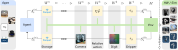

**Robot Control Stack (RCS)** is a flexible Gymnasium wrapper-based robot control interface made for robot learning and specifically Vision-Language-Action (VLA) models.
It unifies MuJoCo simulation and real world robot control with four supported robots: FR3/Panda, xArm7, UR5e and SO101.
It ships with several pre-build apps including data collection via teleoperation and remote model inference via [vlagents](https://github.com/RobotControlStack/vlagents).


<video 
  src="https://github.com/user-attachments/assets/21ac29af-373b-46aa-8a08-ae0ae8c0e235" 
  autoplay 
  muted 
  loop 
  playsinline
  style="max-width: 100%;">
</video>

## Wrapper-Based Architecture



## Example
Flexibly compose your gym environment to your needs:
```python
from time import sleep

import gymnasium as gym
import numpy as np
from rcs._core.sim import SimConfig
from rcs.camera.sim import SimCameraSet
from rcs.envs.base import (
    CameraSetWrapper,
    ControlMode,
    GripperWrapper,
    RelativeActionSpace,
    RelativeTo,
    RobotEnv,
)
from rcs.envs.sim import GripperWrapperSim, RobotSimWrapper
from rcs.envs.utils import (
    default_mujoco_cameraset_cfg,
    default_sim_gripper_cfg,
    default_sim_robot_cfg,
)

import rcs
from rcs import sim

if __name__ == "__main__":
    # default configs
    robot_cfg = default_sim_robot_cfg(scene="fr3_empty_world")
    gripper_cfg = default_sim_gripper_cfg()
    cameras = default_mujoco_cameraset_cfg()
    sim_cfg = SimConfig()
    sim_cfg.realtime = True
    sim_cfg.async_control = True
    sim_cfg.frequency = 1  # in Hz (1 sec delay)

    simulation = sim.Sim(robot_cfg.mjcf_scene_path, sim_cfg)
    ik = rcs.common.Pin(
        robot_cfg.kinematic_model_path,
        robot_cfg.attachment_site,
        urdf=False,
    )

    # base env
    robot = rcs.sim.SimRobot(simulation, ik, robot_cfg)
    env: gym.Env = RobotEnv(robot, ControlMode.CARTESIAN_TQuat)

    # gripper
    gripper = sim.SimGripper(simulation, gripper_cfg)
    env = GripperWrapper(env, gripper, binary=True)

    env = RobotSimWrapper(env, simulation)
    env = GripperWrapperSim(env, gripper)

    # camera
    camera_set = SimCameraSet(simulation, cameras, physical_units=True, render_on_demand=True)
    env = CameraSetWrapper(env, camera_set, include_depth=True)

    # relative actions bounded by 10cm translation and 10 degree rotation
    env = RelativeActionSpace(env, max_mov=(0.1, np.deg2rad(10)), relative_to=RelativeTo.LAST_STEP)

    env.get_wrapper_attr("sim").open_gui()
    # wait for gui to open
    sleep(1)
    env.reset()

    # access low level robot api to get current cartesian position
    print(env.unwrapped.robot.get_cartesian_position())

    for _ in range(10):
        # move 1cm in x direction (forward) and close gripper
        act = {"tquat": [0.01, 0, 0, 0, 0, 0, 1], "gripper": 0}
        obs, reward, terminated, truncated, info = env.step(act)
        print(obs)
```
For common environment compositions factory functions such as `rcs.envs.creators.SimEnvCreator` are provided.
This and other example can be found in the [examples](examples/) folder.

## Installation

We build and test RCS on the latest Debian and on the latest Ubuntu LTS.

1.  **System Dependencies**:
    ```shell
    sudo apt install $(cat debian_deps.txt)
    ```

2.  **Python Environment**:
    ```shell
    conda create -n rcs python=3.11
    conda activate rcs
    pip install -r requirements.txt
    ```

3.  **Install RCS**:
    ```shell
    pip install -ve . --no-build-isolation
    ```

## Hardware Extensions

RCS supports various hardware extensions (e.g., FR3, xArm7, RealSense). These are located in the `extensions` directory.

To install an extension:

```shell
pip install -ve extensions/rcs_fr3 --no-build-isolation
```

For a full list of extensions and detailed documentation, visit [robotcontrolstack.org/extensions](https://robotcontrolstack.org/extensions).

## Documentation


For full documentation, including installation, usage, and API reference, please visit:

**[robotcontrolstack.org](https://robotcontrolstack.org)**

## Citation

If you find RCS useful for your academic work, please consider citing it:

```bibtex
@misc{juelg2025robotcontrolstack,
  title={{Robot Control Stack}: {A} Lean Ecosystem for Robot Learning at Scale}, 
  author={Tobias J{\"u}lg and Pierre Krack and Seongjin Bien and Yannik Blei and Khaled Gamal and Ken Nakahara and Johannes Hechtl and Roberto Calandra and Wolfram Burgard and Florian Walter},
  year={2025},
  howpublished = {\url{https://arxiv.org/abs/2509.14932}}
}
```

For more scientific info, visit the [paper website](https://robotcontrolstack.github.io/).
